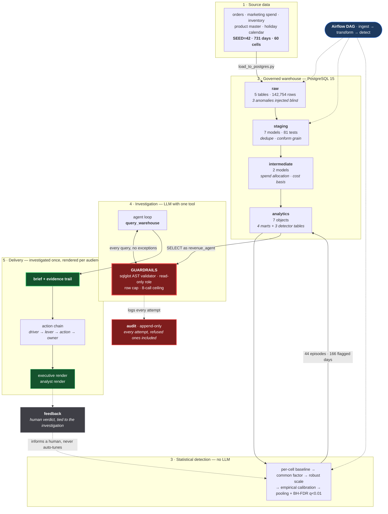

# Revenue Anomaly Root-Cause Investigator

An automated analyst that watches daily revenue, decides which movements are statistically real,
investigates the likely cause against a governed warehouse, and writes the brief a human would
otherwise have spent a day producing.

**The deliverable is the written brief.** Not a chart that shows revenue fell — a written
explanation of why it fell, what to do about it, and the evidence behind both.

---

## BusinessIntelligence.ai

**The problem.** A Revenue Ops lead learns about a sales dip when someone spots it in the weekly
report — three to seven days late, with no explanation attached, and by then the cause is cold and
the revenue unrecoverable. Answering "why" costs an analyst most of a day of manual pulls across
sales, marketing spend and inventory, and the answer arrives after the window to act on it has
closed. The hard part is not charting the dip; it is that a real incident can be invisible in the
total (the largest event here touches 3 of 60 cells), the most available explanation is usually
the wrong one (spend correlates with revenue at ~0.85 by construction), and anything that turns
model output into SQL against a production-shaped warehouse is a security problem before it is a
useful one.

**The solution.** A governed KPI intelligence-to-action pipeline: dbt reconciles five
heterogeneous sources into a tested analytics layer, a per-cell rolling z-score detector separates
real movement from noise, and an LLM agent investigates each incident against six read-only marts
— ranking candidate drivers, ruling out the ones the data eliminates, and writing a brief with
its evidence trail attached. The investigation runs **once**; personas, action recommendations and
feedback all render from that same evidence, so an executive and an analyst can never be told
different facts. The agent reaches the warehouse only through a read-only role, a sqlglot AST
validator, an append-only audit log and a hard tool-call ceiling — all four built and attacked
before the agent existed. When the evidence does not support a cause, the system says so and
recommends nothing; that abstention path is demonstrated on a real transcript, not an example.

| # | Capability | Implemented in |
|---|---|---|
| 1 | Detect & prioritise | [`detection/`](detection/), [`docs/detection_and_prioritisation.md`](docs/detection_and_prioritisation.md) |
| 2 | Reconcile heterogeneous sources | [`docs/data_reconciliation.md`](docs/data_reconciliation.md), [`docs/marts_and_allocation.md`](docs/marts_and_allocation.md) |
| 3 | Rank drivers | [`agent/investigator.py`](agent/investigator.py), [`docs/sample_briefs/`](docs/sample_briefs/) |
| 4 | Persona narratives | [`agent/personas.py`](agent/personas.py), [`docs/aic_personas_and_actions.md`](docs/aic_personas_and_actions.md) |
| 5 | Abstention / low confidence | DET-0018 real transcript, [`docs/aic_personas_and_actions.md`](docs/aic_personas_and_actions.md) |
| 6 | Action recommendations | [`agent/actions.py`](agent/actions.py) |
| 7 | Feedback loop | [`agent/feedback.py`](agent/feedback.py), [`docs/aic_feedback_loop.md`](docs/aic_feedback_loop.md) |
| 8 | Security, cost, latency, scale | [`agent/guardrails/`](agent/guardrails/), [`docs/aic_runtime_telemetry.md`](docs/aic_runtime_telemetry.md), [`docs/aic_rbac_scenario.md`](docs/aic_rbac_scenario.md) |

---

## Approach

Built layer by layer, each one tested before the next was started.



The two red boxes are the point of the design: **there is no path from the agent to the warehouse
that does not go through the validator, and no tool call that does not land in the audit log** —
including the ones that were refused.

---

## Data

Fully synthetic and deterministic at `SEED = 42`, spanning **2024-01-01 to 2025-12-31 (731 days)**
at a grain of **category × channel × region (60 cells)**. Regenerating with the same seed
reproduces every figure to the cent.

Synthetic was a deliberate choice, not a fallback: it is the only way to have a **ground-truth
answer key**. Detection and root-cause attribution can then be *scored* rather than described.

| Table | Grain | Rows | Notes |
|---|---|---|---|
| `raw.daily_revenue` | date × category × channel × region | 43,860 | Carries the three injected anomalies **blind** — no flags, no hints |
| `raw.marketing_spend` | date × channel × category | 10,965 | One grain coarser than revenue *on purpose* — it has no region |
| `raw.product_master` | messy union of 2 source systems | 158 | 120 real SKUs, 24 category spellings, duplicates, nulls |
| `raw.inventory_snapshot` | date × sku | 87,720 | Carries the ANOM-02 stockout |
| `raw.holiday_calendar` | date | 30 | Real US federal holidays plus Black Friday / Cyber Monday |

Total revenue across the series: **$101,656,971.77**. Total marketing spend: **$9,779,277.61**.

### The three injected anomalies

The answer key lives in `docs/ground_truth_anomalies.md` and is **never loaded into Postgres** —
the warehouse holds only the blind series. Each is designed to defeat a different shortcut.

| ID | Window | Cause | Slice | Cells | Delta | Why it's here |
|---|---|---|---|---|---|---|
| **ANOM-01** | 2025-03-14 → 03-17 | Promotion | `category = Apparel` | 12 | **+97.29%** | The easy one. A spike, wide slice — catches a detector that only looks for drops |
| **ANOM-02** | 2025-06-09 → 06-15 | Inventory stockout | `Electronics` **AND** `West` | 3 | **−52.06%** | **The negative control.** Marketing spend is deliberately untouched. Only 3 of 60 cells, so it vanishes in any aggregate |
| **ANOM-03** | 2025-09-22 → 10-05 | Marketing budget cut | `channel = Mobile App` | 20 | **−22.91%** | The hard one. Gradual decay, not a step, with a **5-day lag** between cause and effect |

**ANOM-02 is the case the whole project is built around.** Revenue collapses, spend does not move,
and the cause is a stockout: 6 of 8 tracked SKUs out for exactly the seven event days, zero either
side. An investigator that explains every dip by pointing at marketing spend gets this one wrong,
which is precisely what it is there to test.

Alongside the real events sit **decoys** that must *not* fire: Black Friday, Cyber Monday,
Christmas Eve, Christmas Day, and a genuine Q4 revenue ramp.

### Cleaning the product master

`raw.product_master` is deliberately dirty — the union of a mock ERP export and a mock Shopify
export. Data reconciliation merges 158 rows into 120 SKUs by ranking each SKU's duplicates on
completeness then recency, and taking the first non-null value **per column** rather than picking
a winning row wholesale.

The losing rows are not discarded. `stg_product_master_dedup_audit` keeps all 158, recording which
row won and **which specific field each losing row donated** — so the merge is auditable rather
than merely asserted.

Missing values were decided per column, and the decisions differ on purpose:

| Column | Nulls | Decision | Why |
|---|---|---|---|
| `category` | 18 | **Impute** via duplicate → SKU-prefix → `'Unknown'`, flagged | It's a grouping key for the entire detection layer; a null silently drops the SKU from every rollup |
| `unit_cost` | 18 | **Keep NULL**, flag, exclude from cost basis | A median-imputed cost becomes a fabricated number inside a financial metric that no one questions again |
| `supplier` | 17 | **Keep NULL**, flag | The agent uses supplier in narrative. Imputing would put a real company's name in a brief a human acts on |
| `product_name` | 9 | **Keep NULL**, flag | Display-only — a presentation decision, so it belongs in the mart, not here |

No row is dropped for any missing value.

---

## Method

### Warehouse: raw → staging → marts

dbt, with **191 tests passing**. Staging lands in `staging`, marts in `analytics`, and supporting
models in `intermediate`. That split isn't cosmetic — `macros/generate_schema_name.sql` overrides
dbt's default prefixing so the names are used verbatim, which is what makes "the agent can read
`analytics` and nothing else" an enforceable boundary rather than a naming convention.

Two decisions carry most of the analytical weight:

**Marketing spend has no region, and revenue does.** Spend is allocated to regions by each
region's **trailing 28-day revenue share, excluding the current day**. Same-day allocation was
tested and rejected because it destroys the ANOM-02 control: when West Electronics revenue
collapses, same-day allocation drags allocated spend down with it and *manufactures* a marketing
cause for an inventory problem — measured, it would have shown a 72% spend collapse on 12 June
that never happened. Every cell reconciles to the cent via largest-remainder rounding:
$9,779,277.61 in, $9,779,277.61 out.

**8 SKUs have no unit cost.** They are excluded from the cost basis, never imputed, and the
exclusion is *counted on every margin row* (`skus_excluded_from_cost_basis`,
`cost_basis_coverage_pct`, `excluded_sku_ids`). Coverage runs 88.9% (Beauty) to 96.9%
(Electronics). Margin columns are prefixed `estimated_` because revenue is per category while
cost is per SKU.

The three tests that matter most: `assert_spend_allocation_reconciles` (no money created or
destroyed), `assert_marts_do_not_inflate_revenue` (a SKU-grain dimension must not fan a
category-grain fact out 24×), and `assert_margin_exclusions_are_accounted`.

### Detection: rolling z-score, five stages

Run **per cell, never on a total** — ANOM-02 touches 3 of 60 cells and vanishes into any
aggregate. All arithmetic in log space, because the generating process is multiplicative and its
noise lognormal.

1. **Baseline** — median of the **same weekday** over the trailing 8 weeks, *skipping the most
   recent week* so a 14-day event cannot leak into its own baseline.
2. **Common-factor removal** — subtract the cross-sectional median residual across all 60 cells.
   A move the whole business made together is the calendar, not an incident. This is what absorbs
   the Q4 ramp.
3. **Robust scale** — divide by the spread of that cell's **recent forecast errors** (56 days,
   median/MAD), *not* the spread of the baseline values. Getting this backwards put 13.68% of all
   points over |z| > 3.
4. **Empirical null calibration** (Efron), measured factor 1.047.
5. **Confirmation** — pool over 1/2/3-day windows, Bonferroni ×3, **t-distribution** p-values,
   then **Benjamini–Hochberg FDR at q < 0.01** across all 38,460 tests.

Stage 5 uses the t-distribution because with only ~8 baseline observations the normal
approximation understates the tails sevenfold (p = 0.0027 vs 0.0199 at |z| = 3) and would inflate
false positives.

**Holidays are expected-variance days, not skipped days.** They're excluded from baselines but
still scored, with the limit widened to |z| ≥ 4.8 (measured: holiday |z| p95 is 3.45 vs 2.11 on
ordinary days). On holidays the peer group narrows to the cell's own **category**, because
holiday response is category-scaled — Christmas hits Electronics to 0.12× but Home & Garden only
to 0.51×. Before that fix, Christmas produced **30 false flags at peak |z| 17.99**; after it,
**1 at 5.08**.

### Orchestration

One Airflow DAG — `ingest → transform → detect` — deliberately not more. Airflow 3.1 in a single
container, LocalExecutor, metadata in a separate database on the same Postgres.

Every task is a `BashOperator` whose command starts with `set -euo pipefail`. That's the entire
failure-propagation story: without it a failing step mid-command is swallowed and the task goes
green, which is *worse* than no orchestration because the pipeline looks like it ran. Verified
both ways — a real ingest failure marked the run `failed` and left downstream tasks
`upstream_failed`; the fixed re-run went green end to end.

Orchestration also exposed a latent bug that local runs never would: the loader used
`to_sql(if_exists="replace")`, which issues `DROP TABLE`. Once staging views select from `raw`,
Postgres refuses to drop a table with dependents. The loader now truncates and appends.

### Security & Access Control — four walls, built before the agent

An agent that can query a production-shaped database is a security story. These were built and
attacked before any agent capability existed to test them.

**1. A dedicated read-only role.** `revenue_agent` holds `SELECT` on `analytics`, `INSERT` on the
audit table, and nothing else — no `USAGE` on `raw`, `staging` or `intermediate`, so objects there
aren't even addressable. Verified both ways: `has_table_privilege` reads false on all 16 objects
outside `analytics`, and a live `SELECT` against each returns `permission denied`.

The line that actually matters is `ALTER DEFAULT PRIVILEGES`. A grant lives on an object and dies
with it, and dbt rebuilds every mart with `CREATE TABLE AS` — without it the agent works until the
next DAG run and then silently loses access.

**2. A sqlglot AST validator.** It parses; it does not scan. Postgres dialect set explicitly on
both parse and re-serialise, so *the string that executes is the string that was inspected*.
Refusals in order: multi-statement, non-`SELECT`, `SELECT … INTO`, locking clauses, off-allowlist
functions, any table off the allowlist (including inside CTEs, subqueries and joins), then a
1,000-row `LIMIT` injected or clamped. Unqualified names are rewritten to `analytics.` so
`search_path` cannot redirect them.

**The function check started as a denylist, and that was a real bug.** It was the one asymmetry in
the design, and six functions passed both it *and* the read-only role:

| Function | What it actually did |
|---|---|
| `pg_get_viewdef` | Leaked the stockout view's body, naming `staging` tables the agent cannot query |
| `txid_current` | Forced a WAL write from a "read-only" role |
| `repeat()` | Materialised 64 MB in a single row |
| `current_setting`, `version`, `pg_backend_pid` | Server and session metadata disclosure |

It is now an allowlist of ~70 permitted names. A trap worth knowing: **the names are sqlglot's,
not Postgres's** — `to_char` parses as `TimeToStr`, `date_trunc` as `TimestampTrunc`, `string_agg`
as `GroupConcat`. Listing the Postgres spelling silently fails to permit the function. An
over-tight allowlist is its own failure mode, so 18 realistic analyst queries are asserted in the
unit suite and 5 more run against the live warehouse.

**3. Append-only audit logging, enforced twice.** `GRANT INSERT` only, plus a trigger refusing
`UPDATE`/`DELETE`/`TRUNCATE` from every role *including the owner*. Every attempted tool call is
recorded — inputs, generated SQL, validation outcome, row count, timing — **including refusals**.
The grant is tight enough that `INSERT … RETURNING` fails, because `RETURNING` needs `SELECT`,
which the writer doesn't have. That's the grant working, not an omission.

**4. A hard tool-call ceiling** that raises rather than counts, so a caller that ignores it cannot
loop past it. It is set to 8 by measurement, not by cost: past roughly eight results the oldest
are elided to fit the context window, and the agent spends the next call re-fetching a figure it
already had — the marginal call destroys more evidence than it adds.

### The agent

A hand-written tool-use loop with exactly **one tool**, `query_warehouse`, whose implementation is
the security pipeline in order: budget → validate → execute read-only → audit. The guardrail
modules are imported and called, never reimplemented.

The loop is hand-written rather than an SDK helper because budget exhaustion has to break the loop
*and still produce output* — the model gets a final turn with the tool removed and is told to
write from what it has, marked explicitly as partial. A runner that stops on its own terms cannot
express that.

**Provider-agnostic by construction.** `agent/llm/` defines one neutral `LLMProvider.chat()`
contract; the loop, the grader and the eval talk only to that, and **no vendor SDK is imported
anywhere outside `agent/llm/`**. Three adapters ship: `groq`, `anthropic`, and a generic
`openai-compatible` one covering Together/OpenRouter/local vLLM by URL alone.

That interface earned itself immediately. The project was built against the Anthropic API; partway
through, the account ran out of credit and no paid budget was available. Switching to
Groq's free tier cost one adapter and no change to the investigation logic — and, critically,
**no change to any guardrail**. Verified mechanically: `git status --short agent/guardrails/
agent/audit/` is empty across the pivot.

This is a **cost decision, not a technical judgement**. An open-weights model on a free tier is a
weaker analyst than a frontier model, and the eval is meant to report what that costs rather than
gloss over it.

---

## Results

### Detection — validated against the held-out answer key

All three injected anomalies detected, scored against `docs/ground_truth_anomalies.md`:

| ID | Difficulty | First fired | **Lag** | Cells found | Peak \|z\| |
|---|---|---|---|---|---|
| ANOM-01 | easy | 2025-03-14 | **0 days** | 12 of 12 | 12.81 |
| ANOM-02 | medium | 2025-06-10 | **1 day** | 3 of 3 | 17.72 |
| ANOM-03 | hard | 2025-09-26 | **4 days** | 14 of 20 | 7.01 |

Against a baseline of "someone spots it in the weekly report three to seven days later," a 0–4 day
detection lag is the headline number of the whole project.

**Decoys behaved:** Black Friday, Cyber Monday and Christmas Eve produced **zero** flags;
Christmas Day 1 of 120 (an idiosyncratic small cell, analysed in the doc); the Q4 ramp 2 of 5,700.

| Measure | Value |
|---|---|
| False-positive rate outside injected windows | **0.09%** |
| Episode precision | 70.5% (31 real, 13 false) |
| Median false-episode length | 1 day |
| Output | 44 episodes, 166 flagged cell-days |

No STL decomposition was written — the z-score approach did not fail on ANOM-03, so the fallback
wasn't needed.

### Guardrails — 83 live attack attempts

Every attempt fired twice: once through the validator, and once straight down the connection with
the validator removed, to prove the database-level wall independently.

| Outcome | Count |
|---|---|
| Blocked as expected | **62** |
| Legitimate reads allowed | **21** |
| **Unexpected outcomes** | **0** |
| Agent-identity attempts reconciled against audit rows | **80 of 80** |

Writes, `DROP`s, semicolon-chained injections, raw-schema reads hidden in CTEs and subqueries,
`SELECT … INTO`, `pg_read_file`, privilege escalation and audit tampering — all refused. (The 3
owner-identity trigger tests correctly *cannot* appear in a log written over the agent's
connection; the harness prints that split rather than leaving the arithmetic to the reader.)

The chain was then re-verified end to end through the new Groq adapter with every query generated
by the live model: 7 tool calls attempted, 6 executed, 1 refused by the validator, the call cap
fired on cue, 7 audit rows written, all under `db_role = revenue_agent`.

### Sample output

Five investigated briefs, each with its evidence trail and the SQL that produced it, are in
[`docs/sample_briefs/eval/`](docs/sample_briefs/eval/). The negative control is the one to read:
on the stockout the brief names inventory and *explicitly rules out* marketing spend with figures
($108.35/day before, $107.77/day during) rather than inventing a spend story.

---

## Running it

```bash
cp .env.example .env          # then set passwords
docker compose up -d --build  # Postgres + Airflow

python -m generators.load_to_postgres     # raw layer
run_dbt.bat build                         # staging + marts, 191 tests
python -m detection.run_detection         # detect
python -m detection.validate              # score against ground truth

python -m agent.guardrails.provision      # read-only agent role + audit table
python -m tests.test_guardrails           # 22 unit tests, no database
python -m tests.attack_attempts           # 83 live attack attempts

python -m dashboards.provision_reporting --verify   # third read-only role + boundary proof
python -m agent.run_investigation --anomaly-key DET-0023
```

Or trigger the whole pipeline at once:

```bash
docker compose exec airflow airflow dags trigger revenue_anomaly_pipeline
```

Airflow UI on `http://localhost:8080`.

**Two gotchas worth knowing before you start.** Postgres is published on **5433**, not 5432,
because a native Windows service already owns 5432 on the development machine — and dbt must be
invoked through `run_dbt.bat`, which loads `.env` into the real process environment, because
dbt's `env_var()` reads the environment and nothing else populates it from the file.

### Documentation

| Doc | Covers |
|---|---|
| `docs/ground_truth_anomalies.md` | The answer key, never loaded into the warehouse |
| `docs/data_reconciliation.md` | Dedupe rule, category standardisation, missing-value policy |
| `docs/marts_and_allocation.md` | Spend allocation and the uncosted-SKU decision |
| `docs/detection_and_prioritisation.md` | Full method and validation |
| `docs/security_guardrails.md` | Each guardrail, and the complete attack transcript |
| `docs/aic_kpi_semantic_contract.md` | KPI definitions, drivers, thresholds, lineage and access |
| `docs/aic_personas_and_actions.md` | Persona rendering and the action chain, with the abstention case |
| `docs/aic_feedback_loop.md` | What feedback is captured, and what production would extend |
| `docs/aic_runtime_telemetry.md` | Measured latency, model calls, tokens and cost |
| `docs/aic_rbac_scenario.md` | Role-based access: the three identities and what each may reach |
| `docs/aic_llm_vs_nonllm_breakdown.md` | Which layers use a model, and which deliberately do not |
| `docs/aic_sparse_history_scenario.md` | Behaviour on a newly launched cell with 21 days of history |
