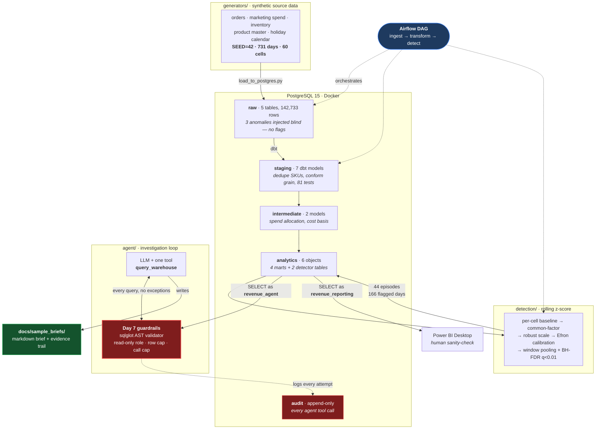

# Revenue Anomaly Root-Cause Investigator

An automated analyst that watches daily revenue, decides which movements are statistically real,
investigates the likely cause against a governed warehouse, and writes the brief a human would
otherwise have spent a day producing.

**The deliverable is the written brief, not the dashboard.** The dashboard exists so a human can
sanity-check the brief.

---

## The Problem

The Revenue Ops lead at a retail company finds out about a sales drop the same way everyone else
does: someone notices it in the weekly report. By that point the drop is typically three to seven
days old, and the report says only that revenue is down — not which category, channel, or region
moved, and not why. Someone then spends the better part of a day pulling numbers to answer a
question that has already gone stale, and the window to act on the cause has usually closed.

This project closes that gap: it watches daily revenue as it lands, separates a real drop from
ordinary daily fluctuation, checks the usual suspects — marketing spend, inventory, and outside
factors — and writes up what it found, before anyone has opened the weekly report.

Three things make that harder than it sounds, and each drove a design decision below:

1. **A real incident can be invisible in the total.** The largest injected event in this dataset
   touches 3 of 60 category × channel × region cells. Aggregate the series and it disappears
   into noise, so detection runs per cell, never on a total.
2. **The obvious explanation is usually the wrong one.** Marketing spend correlates with revenue
   at roughly 0.85 across this business by construction. An investigator that reaches for spend
   every time will be confidently wrong on any incident that isn't a spend problem.
3. **An agent that can query the warehouse is a security story.** Anything that turns model
   output into SQL against a production-shaped database needs walls that exist before the
   capability does.

---

## Approach

Built layer by layer over nine days, each one tested before the next was started.



The two red boxes are the point of the design: **there is no path from the agent to the warehouse
that does not go through the validator, and no tool call that does not land in the audit log** —
including the ones that were refused.

### Design principles held throughout

| Principle | How it shows up |
|---|---|
| **Guardrails before capability** | Day 7 built and attacked the walls before Day 8 wrote a single agent call |
| **Allowlists, never denylists** | Tables, statement types and SQL functions. The one denylist in the design leaked six functions and was inverted |
| **State the assumption in the name** | `estimated_gross_margin`, `spend_allocation_basis`, `is_margin_estimable` — an approximation that doesn't announce itself gets quoted as fact |
| **Evidence over assertion** | Every brief ships with the SQL that produced it; every detection claim is scored against a held-out answer key |
| **Verified, or it isn't done** | The phase marker in `CLAUDE.md` has never moved on unverified work — including right now |

---

## Data

Fully synthetic and deterministic at `SEED = 42`, spanning **2024-01-01 to 2025-12-31 (731 days)**
at a grain of **category × channel × region (60 cells)**. Regenerating with the same seed
reproduces every figure to the cent.

Synthetic was a deliberate choice, not a fallback: it is the only way to have a **ground-truth
answer key**. Detection and root-cause attribution can then be *scored* rather than described.

| Table | Grain | Rows | Notes |
|---|---|---|---|
| `raw.daily_revenue` | date × category × channel × region | 43,860 | Carries the three injected anomalies **blind** — no flags, no hints |
| `raw.marketing_spend` | date × channel × category | 10,965 | One grain coarser than revenue *on purpose* — it has no region |
| `raw.product_master` | messy union of 2 source systems | 158 | 120 real SKUs, 24 category spellings, duplicates, nulls |
| `raw.inventory_snapshot` | date × sku | 87,720 | Carries the ANOM-02 stockout |
| `raw.holiday_calendar` | date | 30 | Real US federal holidays plus Black Friday / Cyber Monday |

Total revenue across the series: **$101,656,971.77**. Total marketing spend: **$9,779,277.61**.

### The three injected anomalies

The answer key lives in `docs/ground_truth_anomalies.md` and is **never loaded into Postgres** —
the warehouse holds only the blind series. Each is designed to defeat a different shortcut.

| ID | Window | Cause | Slice | Cells | Delta | Why it's here |
|---|---|---|---|---|---|---|
| **ANOM-01** | 2025-03-14 → 03-17 | Promotion | `category = Apparel` | 12 | **+97.29%** | The easy one. A spike, wide slice — catches a detector that only looks for drops |
| **ANOM-02** | 2025-06-09 → 06-15 | Inventory stockout | `Electronics` **AND** `West` | 3 | **−52.06%** | **The negative control.** Marketing spend is deliberately untouched. Only 3 of 60 cells, so it vanishes in any aggregate |
| **ANOM-03** | 2025-09-22 → 10-05 | Marketing budget cut | `channel = Mobile App` | 20 | **−22.91%** | The hard one. Gradual decay, not a step, with a **5-day lag** between cause and effect |

**ANOM-02 is the case the whole project is built around.** Revenue collapses, spend does not move,
and the cause is a stockout: 6 of 8 tracked SKUs out for exactly the seven event days, zero either
side. An investigator that explains every dip by pointing at marketing spend gets this one wrong,
which is precisely what it is there to test.

Alongside the real events sit **decoys** that must *not* fire: Black Friday, Cyber Monday,
Christmas Eve, Christmas Day, and a genuine Q4 revenue ramp.

### Cleaning the product master

`raw.product_master` is deliberately dirty — the union of a mock ERP export and a mock Shopify
export. Day 3 reconciles 158 rows into 120 SKUs by ranking each SKU's duplicates on completeness
then recency, and taking the first non-null value **per column** rather than picking a winning
row wholesale.

The losing rows are not discarded. `stg_product_master_dedup_audit` keeps all 158, recording which
row won and **which specific field each losing row donated** — so the merge is auditable rather
than merely asserted.

Missing values were decided per column, and the decisions differ on purpose:

| Column | Nulls | Decision | Why |
|---|---|---|---|
| `category` | 18 | **Impute** via duplicate → SKU-prefix → `'Unknown'`, flagged | It's a grouping key for the entire detection layer; a null silently drops the SKU from every rollup |
| `unit_cost` | 18 | **Keep NULL**, flag, exclude from cost basis | A median-imputed cost becomes a fabricated number inside a financial metric that no one questions again |
| `supplier` | 17 | **Keep NULL**, flag | The agent uses supplier in narrative. Imputing would put a real company's name in a brief a human acts on |
| `product_name` | 9 | **Keep NULL**, flag | Display-only — a presentation decision, so it belongs in the mart, not here |

No row is dropped for any missing value.

---

## Method

### Warehouse: raw → staging → marts

dbt, with **191 tests passing**. Staging lands in `staging`, marts in `analytics`, and supporting
models in `intermediate`. That split isn't cosmetic — `macros/generate_schema_name.sql` overrides
dbt's default prefixing so the names are used verbatim, which is what makes "the agent can read
`analytics` and nothing else" an enforceable boundary rather than a naming convention.

Two decisions carry most of the analytical weight:

**Marketing spend has no region, and revenue does.** Spend is allocated to regions by each
region's **trailing 28-day revenue share, excluding the current day**. Same-day allocation was
tested and rejected because it destroys the ANOM-02 control: when West Electronics revenue
collapses, same-day allocation drags allocated spend down with it and *manufactures* a marketing
cause for an inventory problem — measured, it would have shown a 72% spend collapse on 12 June
that never happened. Every cell reconciles to the cent via largest-remainder rounding:
$9,779,277.61 in, $9,779,277.61 out.

**8 SKUs have no unit cost.** They are excluded from the cost basis, never imputed, and the
exclusion is *counted on every margin row* (`skus_excluded_from_cost_basis`,
`cost_basis_coverage_pct`, `excluded_sku_ids`). Coverage runs 88.9% (Beauty) to 96.9%
(Electronics). Margin columns are prefixed `estimated_` because revenue is per category while
cost is per SKU.

The three tests that matter most: `assert_spend_allocation_reconciles` (no money created or
destroyed), `assert_marts_do_not_inflate_revenue` (a SKU-grain dimension must not fan a
category-grain fact out 24×), and `assert_margin_exclusions_are_accounted`.

### Detection: rolling z-score, five stages

Run **per cell, never on a total** — ANOM-02 touches 3 of 60 cells and vanishes into any
aggregate. All arithmetic in log space, because the generating process is multiplicative and its
noise lognormal.

1. **Baseline** — median of the **same weekday** over the trailing 8 weeks, *skipping the most
   recent week* so a 14-day event cannot leak into its own baseline.
2. **Common-factor removal** — subtract the cross-sectional median residual across all 60 cells.
   A move the whole business made together is the calendar, not an incident. This is what absorbs
   the Q4 ramp.
3. **Robust scale** — divide by the spread of that cell's **recent forecast errors** (56 days,
   median/MAD), *not* the spread of the baseline values. Getting this backwards put 13.68% of all
   points over |z| > 3.
4. **Empirical null calibration** (Efron), measured factor 1.047.
5. **Confirmation** — pool over 1/2/3-day windows, Bonferroni ×3, **t-distribution** p-values,
   then **Benjamini–Hochberg FDR at q < 0.01** across all 38,460 tests.

Stage 5 uses the t-distribution because with only ~8 baseline observations the normal
approximation understates the tails sevenfold (p = 0.0027 vs 0.0199 at |z| = 3) and would inflate
false positives.

**Holidays are expected-variance days, not skipped days.** They're excluded from baselines but
still scored, with the limit widened to |z| ≥ 4.8 (measured: holiday |z| p95 is 3.45 vs 2.11 on
ordinary days). On holidays the peer group narrows to the cell's own **category**, because
holiday response is category-scaled — Christmas hits Electronics to 0.12× but Home & Garden only
to 0.51×. Before that fix, Christmas produced **30 false flags at peak |z| 17.99**; after it,
**1 at 5.08**.

### Orchestration

One Airflow DAG — `ingest → transform → detect` — deliberately not more. Airflow 3.1 in a single
container, LocalExecutor, metadata in a separate database on the same Postgres.

Every task is a `BashOperator` whose command starts with `set -euo pipefail`. That's the entire
failure-propagation story: without it a failing step mid-command is swallowed and the task goes
green, which is *worse* than no orchestration because the pipeline looks like it ran. Verified
both ways — a real ingest failure marked the run `failed` and left downstream tasks
`upstream_failed`; the fixed re-run went green end to end.

Orchestration also exposed a latent bug that local runs never would: the loader used
`to_sql(if_exists="replace")`, which issues `DROP TABLE`. Once staging views select from `raw`,
Postgres refuses to drop a table with dependents. The loader now truncates and appends.

### Guardrails — four walls, built before the agent

An agent that can query a production-shaped database is a security story. These were built and
attacked on Day 7, before any agent capability existed to test them.

**1. A dedicated read-only role.** `revenue_agent` holds `SELECT` on `analytics`, `INSERT` on the
audit table, and nothing else — no `USAGE` on `raw`, `staging` or `intermediate`, so objects there
aren't even addressable. Verified both ways: `has_table_privilege` reads false on all 16 objects
outside `analytics`, and a live `SELECT` against each returns `permission denied`.

The line that actually matters is `ALTER DEFAULT PRIVILEGES`. A grant lives on an object and dies
with it, and dbt rebuilds every mart with `CREATE TABLE AS` — without it the agent works until the
next DAG run and then silently loses access.

**2. A sqlglot AST validator.** It parses; it does not scan. Postgres dialect set explicitly on
both parse and re-serialise, so *the string that executes is the string that was inspected*.
Refusals in order: multi-statement, non-`SELECT`, `SELECT … INTO`, locking clauses, off-allowlist
functions, any table off the allowlist (including inside CTEs, subqueries and joins), then a
1,000-row `LIMIT` injected or clamped. Unqualified names are rewritten to `analytics.` so
`search_path` cannot redirect them.

**The function check started as a denylist, and that was a real bug.** It was the one asymmetry in
the design, and six functions passed both it *and* the read-only role:

| Function | What it actually did |
|---|---|
| `pg_get_viewdef` | Leaked the stockout view's body, naming `staging` tables the agent cannot query |
| `txid_current` | Forced a WAL write from a "read-only" role |
| `repeat()` | Materialised 64 MB in a single row |
| `current_setting`, `version`, `pg_backend_pid` | Server and session metadata disclosure |

It is now an allowlist of ~70 permitted names. A trap worth knowing: **the names are sqlglot's,
not Postgres's** — `to_char` parses as `TimeToStr`, `date_trunc` as `TimestampTrunc`, `string_agg`
as `GroupConcat`. Listing the Postgres spelling silently fails to permit the function. An
over-tight allowlist is its own failure mode, so 18 realistic analyst queries are asserted in the
unit suite and 5 more run against the live warehouse.

**3. Append-only audit logging, enforced twice.** `GRANT INSERT` only, plus a trigger refusing
`UPDATE`/`DELETE`/`TRUNCATE` from every role *including the owner*. Every attempted tool call is
recorded — inputs, generated SQL, validation outcome, row count, timing — **including refusals**.
The grant is tight enough that `INSERT … RETURNING` fails, because `RETURNING` needs `SELECT`,
which the writer doesn't have. That's the grant working, not an omission.

**4. A hard tool-call ceiling** that raises rather than counts, so a caller that ignores it cannot
loop past it.

### The agent

A hand-written tool-use loop with exactly **one tool**, `query_warehouse`, whose implementation is
the Day 7 pipeline in order: budget → validate → execute read-only → audit. Day 7's modules are
imported and called, never reimplemented.

The loop is hand-written rather than an SDK helper because budget exhaustion has to break the loop
*and still produce output* — the model gets a final turn with the tool removed and is told to
write from what it has, marked explicitly as partial. A runner that stops on its own terms cannot
express that.

**Provider-agnostic by construction.** `agent/llm/` defines one neutral `LLMProvider.chat()`
contract; the loop, the grader and the eval talk only to that, and **no vendor SDK is imported
anywhere outside `agent/llm/`**. Three adapters ship: `groq`, `anthropic`, and a generic
`openai-compatible` one covering Together/OpenRouter/local vLLM by URL alone.

That interface earned itself immediately. The project was built against the Anthropic API; on
Day 8 the account ran out of credit and the author is a student who cannot fund it. Switching to
Groq's free tier cost one adapter and no change to the investigation logic — and, critically,
**no change to any guardrail**. Verified mechanically: `git status --short agent/guardrails/
agent/audit/` is empty across the pivot.

This is a **cost decision, not a technical judgement**. An open-weights model on a free tier is a
weaker analyst than a frontier model, and the eval is meant to report what that costs rather than
gloss over it.

---

## Results

### Detection — validated against the held-out answer key

All three injected anomalies detected, scored against `docs/ground_truth_anomalies.md`:

| ID | Difficulty | First fired | **Lag** | Cells found | Peak \|z\| |
|---|---|---|---|---|---|
| ANOM-01 | easy | 2025-03-14 | **0 days** | 12 of 12 | 12.81 |
| ANOM-02 | medium | 2025-06-10 | **1 day** | 3 of 3 | 17.72 |
| ANOM-03 | hard | 2025-09-26 | **4 days** | 14 of 20 | 7.01 |

Against a baseline of "someone spots it in the weekly report three to seven days later," a 0–4 day
detection lag is the headline number of the whole project.

**Decoys behaved:** Black Friday, Cyber Monday and Christmas Eve produced **zero** flags;
Christmas Day 1 of 120 (an idiosyncratic small cell, analysed in the doc); the Q4 ramp 2 of 5,700.

| Measure | Value |
|---|---|
| False-positive rate outside injected windows | **0.09%** |
| Episode precision | 70.5% (31 real, 13 false) |
| Median false-episode length | 1 day |
| Output | 44 episodes, 166 flagged cell-days |

No STL decomposition was written — the z-score approach did not fail on ANOM-03, so the fallback
wasn't needed.

### Guardrails — 83 live attack attempts

Every attempt fired twice: once through the validator, and once straight down the connection with
the validator removed, to prove the database-level wall independently.

| Outcome | Count |
|---|---|
| Blocked as expected | **62** |
| Legitimate reads allowed | **21** |
| **Unexpected outcomes** | **0** |
| Agent-identity attempts reconciled against audit rows | **80 of 80** |

Writes, `DROP`s, semicolon-chained injections, raw-schema reads hidden in CTEs and subqueries,
`SELECT … INTO`, `pg_read_file`, privilege escalation and audit tampering — all refused. (The 3
owner-identity trigger tests correctly *cannot* appear in a log written over the agent's
connection; the harness prints that split rather than leaving the arithmetic to the reader.)

The chain was then re-verified end to end through the new Groq adapter with every query generated
by the live model: 7 tool calls attempted, 6 executed, 1 refused by the validator, the call cap
fired on cue, 7 audit rows written, all under `db_role = revenue_agent`.

One honest note from that run: the model **self-refused 5 of 7 attack prompts** before the
validator ever saw them. That's defence in depth, not a passed guardrail test, so the probe set
was extended until attempts actually reached the wall.

### Agent investigation quality

> ### ⏳ [PENDING: Day 8 eval results — 10-scenario run against `gpt-oss-120b`, **0 of 10 scored**]
>
> **Nothing is reported here yet because nothing has been measured yet.** The eval harness, the
> answer key and the grader are built and committed; the scored run has not completed.
>
> **What exists:** a 10-scenario answer key — the 3 ground-truth anomalies transcribed from
> `docs/ground_truth_anomalies.md`, plus 7 detected episodes whose expected conclusions were
> decided **by the project owner**, from raw evidence, before any brief was generated. The agent's
> author does not get to write the standard the agent is graded against. The grader extracts
> structured claims via a forced tool call, then compares them mechanically, so no pass/fail
> depends on a model's opinion of "close enough".
>
> **Why it hasn't finished:** the free tier meters 8,000 tokens/minute *and* 200,000 tokens per
> **rolling 24 hours** — not a midnight reset. Because every tool call re-sends the whole
> conversation, one investigation costs ~40,000 tokens, so the daily quota sustains roughly five.
> The last attempt was stopped mid-way through the first scenario with the quota exhausted, and
> scored nothing. The harness writes results after every scenario and merges across runs, so the
> sweep can be completed in batches without losing what it already scored.
>
> **This section will report the real pass rate, the misses, and whether ANOM-02's negative
> control was handled correctly** — i.e. whether the brief explicitly *rules out* marketing spend
> rather than inventing a spend-based explanation. Including if the numbers are poor.

One measured finding already recorded, because it changed the design: at a 20-call ceiling the
agent spent all 20 calls and re-queried tables it had already read, then produced no brief at all.
The cause is the context window — past roughly eight results the oldest are elided to fit, the
model notices a figure it needs is gone, and spends the next call re-fetching it, which evicts
another. **The marginal call beyond ~8 destroys more evidence than it adds.** The ceiling is now 8,
justified by that measurement rather than by cost.

### Dashboard

> ### ⏳ [PENDING: Power BI dashboard screenshots, manual build not yet complete]
>
> The **database side is done and verified**: `revenue_reporting`, a third login holding `SELECT`
> on `analytics` and nothing else — deliberately *tighter* than the agent, which also holds
> `INSERT` on the audit table. Verified live: 6 objects readable, 4 forbidden schema reads
> refused, 5 write attempts refused.
>
> The `.pbix` is built by hand from `docs/day9_dashboard_build_guide.md` and does not exist yet.
> Screenshots and the file land here once it has actually been built and checked.

---

## Running it

```bash
cp .env.example .env          # then set passwords
docker compose up -d --build  # Postgres + Airflow

python -m generators.load_to_postgres     # raw layer
run_dbt.bat build                         # staging + marts, 191 tests
python -m detection.run_detection         # detect
python -m detection.validate              # score against ground truth

python -m agent.guardrails.provision      # read-only agent role + audit table
python -m tests.test_guardrails           # 22 unit tests, no database
python -m tests.attack_attempts           # 83 live attack attempts

python -m dashboards.provision_reporting --verify   # BI role + boundary proof
python -m agent.run_investigation --anomaly-key DET-0023
```

Or trigger the whole pipeline at once:

```bash
docker compose exec airflow airflow dags trigger revenue_anomaly_pipeline
```

Airflow UI on `http://localhost:8080`.

**Two gotchas worth knowing before you start.** Postgres is published on **5433**, not 5432,
because a native Windows service already owns 5432 on the development machine — and dbt must be
invoked through `run_dbt.bat`, which loads `.env` into the real process environment, because
dbt's `env_var()` reads the environment and nothing else populates it from the file. Both are
documented in full in `CLAUDE.md`.

### Documentation

| Doc | Covers |
|---|---|
| `CLAUDE.md` | The persistent source of truth — locked scope, every layer's contract, six hard-won gotchas |
| `docs/ground_truth_anomalies.md` | The answer key, never loaded into the warehouse |
| `docs/day3_staging_decisions.md` | Dedupe rule, category standardisation, missing-value policy |
| `docs/day4_marts_decisions.md` | Spend allocation and the uncosted-SKU decision |
| `docs/day5_detection_results.md` | Full method and validation |
| `docs/day7_guardrails.md` | Each guardrail, and the complete attack transcript |
| `docs/day9_powerbi_connection.md` · `day9_dax_measures.md` · `day9_dashboard_build_guide.md` | Connection, measures with their assumptions, step-by-step build |

---

## What I'd do with more time

**Detection**

- **Run STL decomposition alongside the z-score and compare on the same answer key.** It was
  scoped as a fallback and never needed — but "we didn't need it" is weaker than "we ran both and
  here is the difference."
- **Widen severity beyond `peak_z_score`.** Measured across the 44 episodes, the Critical band
  (8 episodes, $83.7k absolute impact) and the High band (16, $85.2k) carry near-identical dollar
  impact. z measures distance from normal, not money. A severity score blending magnitude,
  duration and dollars would rank better.
- **More anomaly archetypes** — pricing errors, competitor entry, a data-quality outage that looks
  exactly like a revenue collapse. The last one is the most valuable, because it is the failure
  mode most likely to produce a confident, wrong brief.

**Agent**

- **Re-run the eval on a frontier model** and report both. The free-tier constraint is real and
  documented, but the honest comparison is "here is what capability costs," not "here is the free
  answer."
- **Give the investigation a working memory.** The 8-call ceiling is imposed by an 8k context
  window, not by what the analysis needs. With a larger budget the agent could keep an evidence
  ledger and stop re-querying what it has already seen.
- **Self-consistency on the conclusion** — run the investigation three times and report agreement.
  A cause named identically three times from three independent paths is worth more than one
  confident brief.

**Platform**

- **CI.** Deliberately deferred in the locked scope, and the first thing I'd add: run the 191 dbt
  tests, the 22 guardrail unit tests and the attack harness on every push. The attack harness in
  particular is exactly the kind of thing that rots silently.
- **Incremental dbt models.** The pipeline rebuilds all 43,860 rows every run. Fine at this size,
  wrong at any real one.
- **Data-quality monitoring on the raw layer** — a source freshness or row-count check, so a
  pipeline that silently ingests half a day's orders is caught before the detector reports it as
  a revenue collapse.
- **Deliver the brief where people are** (Slack/email). Explicitly out of scope here — a brief
  nobody reads has the same value as no brief, but delivery is plumbing next to the analysis.
- **SCD-2 snapshots on the product master**, so a SKU changing category doesn't silently rewrite
  history.

**Honest limitations of what exists**

- Everything is synthetic. The cleaning problems are realistic but *curated*; real source data
  fails in ways nobody anticipated.
- 60 cells is small. At thousands, the cross-sectional common-factor step and per-cell scoring
  both need re-thinking for cost.
- The agent reads six pre-modelled tables. It cannot ask a question the marts don't already
  answer — which is a real ceiling on root-cause analysis, and a deliberate trade against letting
  it roam the warehouse.
